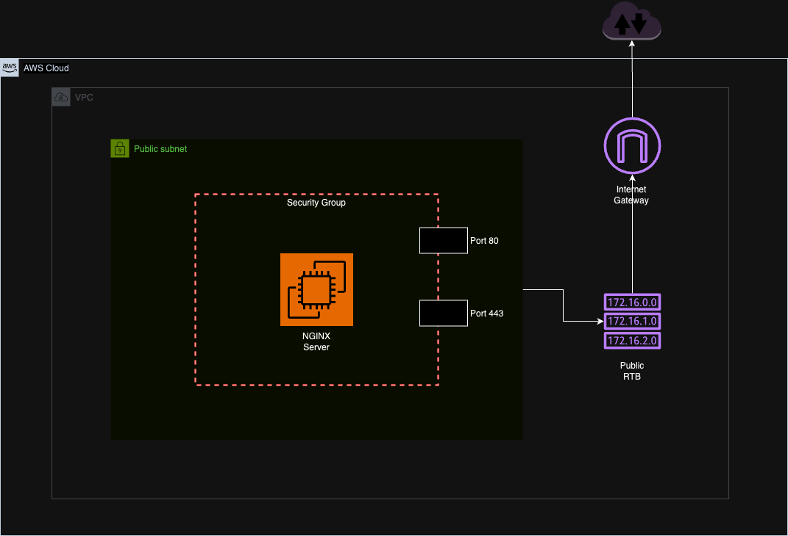

# **Infrastructure as Code (IaC) Project: Deploying an NGINX Server**

## **Introduction**

This project demonstrates the use of Infrastructure as Code (IaC) to deploy an **NGINX server** on an AWS EC2 instance. The infrastructure includes a VPC, subnet, internet gateway, and other components required to allow TCP connections from the internet on ports **80 (HTTP)** and **443 (HTTPS)**.

---

## **Steps for Creating the Infrastructure**

1. **Deploy a VPC and Subnet**:
   - Create a custom Virtual Private Cloud (VPC) and a public subnet.

2. **Set Up Internet Access**:
   - Deploy an Internet Gateway and associate it with the VPC.

3. **Configure Routing**:
   - Create a route table with a route to the Internet Gateway.
   - Associate the route table with the public subnet.

4. **Launch an EC2 Instance**:
   - Deploy an EC2 instance inside the public subnet.
   - Assign a public IP address to the instance.

5. **Install NGINX**:
   - Use a publicly available NGINX Amazon Machine Image (AMI) for the EC2 instance to automatically configure the web server.

6. **Destroy the Infrastructure**:
   - Clean up all resources created during the deployment.

---

## **Infrastructure Design**

The architecture for this Terraform project is illustrated below:



---

## **Usage**

1. Clone the repository:
   ```bash
   git clone https://github.com/bokal2/terraform-projects.git
   cd terraform-projects/project01
   ```

2. Initialize Terraform:
   ```bash
   terraform init
   ```

3. Plan the deployment:
   ```bash
   terraform plan
   ```

4. Apply the configuration:
   ```bash
   terraform apply
   ```

5. Verify the deployment:
   - Access the EC2 instance's public IP in a browser to see the default NGINX page.

6. Destroy the resources when no longer needed:
   ```bash
   terraform destroy
   ```
